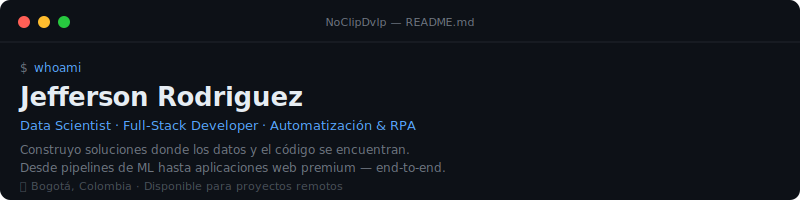
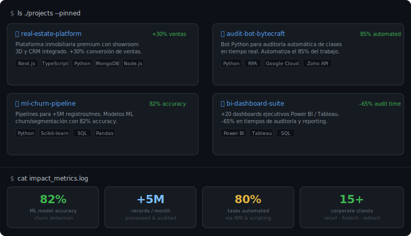

<!-- WHOAMI BLOCK -->


<br/>

<!-- CONTACT BADGES -->
<div align="center">

[](mailto:davidromoda1@gmail.com)
[](https://linkedin.com/in/jefferson-rodriguez)
[](https://github.com/NoClipDvlp)

</div>

<br/>

<!-- SKILLS SECTION -->

```bash
$ cat skills.json
```

**`Data Science & Analytics`**


**`Full-Stack & Back-End`**


**`Cloud & Automatización`**


<br/>

<!-- PROJECTS + METRICS SVG -->




<!-- FOOTER SVG -->


<!-- FOOTER WAVE -->

